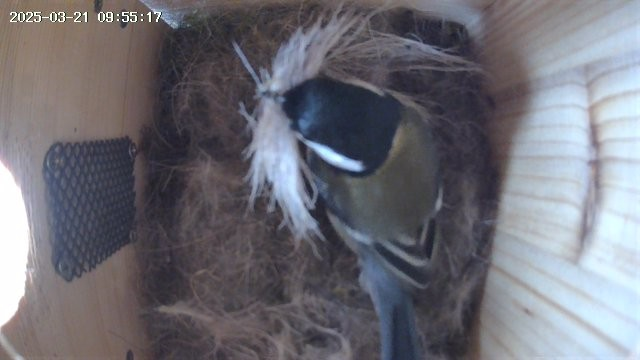

J'ai le plaisir de vous présenter mon tout nouveau projet : un nichoir connecté pour observer les oiseaux !

## Qu'est-ce qu'un nichoir connecté ?

Un nichoir connecté est un nichoir pour petits passereaux (des mésanges, des sitelles, etc.) équipé d'une caméra permettant d'observer la vie des oiseaux sans les déranger. Ce dispositif permet de collecter des données précieuses sur le comportement des oiseaux, leur nidification et leur reproduction, tout en offrant une expérience immersive pour les enfants et les parents, tous passionnés d'ornithologie.

Mon nichoir est facile à fabriquer, il faut :
- Un nichoir en bois avec un double plafond pour y installer une caméra, et une entrée suffisamment petite pour ne laisser passer que des passereaux
- Une caméra de sécurité (j'ai ça : https://www.cdiscount.com/bricolage/securite-domotique/2k-camra-surveillance-wifi/f-166200402-aaant43095.html#mpos=0|mp) qui a plusieurs propriétés intéressantes :
- La possibilité de connecter la caméra au wifi local
- Une caméra de vision nocturne, une lumière
- Une application téléphone permettant un mode vidéo live, un mode détection de mouvements
- Un petit panneau solaire pour charger la caméra
- Installer le nichoir en hauteur (le mien est à 2.5 mètres), et pas au soleil pour qu'il n'y fasse pas trop chaud
  

## Pourquoi ce projet ?

Passionnée par la nature et particulièrement les oiseaux, ma femme adore les observer, se promener, les écouter.  
Pour Noël, j'ai donc fait ce projet  qui me permet de combiner mes compétences en développement web et son intérêt pour l'ornithologie.
De plus, j'ai fait un petit site web pour faciliter le partage des photos et des vidéos de nos amis à plumes.

L'avantage d'utiliser une caméra de sécurité, c'est que toutes les fonctionnalités "tech" sont déjà déployées et économiques, j'aurais 
préféré la bricoler moi même avec un Raspberry Pi, mais c'était le plus facile.

## Visitez le site du nichoir

Pour découvrir ce projet en détail, suivre l'activité des oiseaux en temps réel et explorer les données collectées, je vous invite à visiter le site dédié à cette initiative :

[nichoir.lamarque.tech](https://nichoir.lamarque.tech)

Le site vous permettra de consulter l'historique des visites d'oiseaux, de montrer tout ça à vos enfants.

## Aspects techniques

Pour les curieux qui s'intéressent à l'aspect technique :
- Le code du site est là : https://github.com/Fabinout/NichoirConnect-
- C'est du bête javascript/html/css qui tourne sur node
- Le site est hébergé sur un VPS OVH à 5€ par mois
- Les images sont hébergées sur un bucket OVH.

Je partagerai prochainement plus de détails sur la conception et la réalisation de ce projet pour ceux qui souhaiteraient construire leur propre nichoir connecté.

N'hésitez pas à visiter le site et à me faire part de vos commentaires et suggestions pour améliorer ce projet !

